# 🌱 Smart Greenhouse — A Unified Multi-Protocol IoT System

> Integrating **Zigbee** and **LoRaWAN** sensor nodes over a single **MQTT** fabric, with a live web dashboard and an applied **MQTT security assessment**.

**Author:** Mohammed Elmadani · MSc Cyber Security, University of Bari Aldo Moro

---

## Table of Contents

1. [Overview](#1-overview)
2. [System Architecture](#2-system-architecture)
3. [Network Topology](#3-network-topology)
4. [Hardware — Boards & Sensors](#4-hardware--boards--sensors)
5. [The Wireless Technologies](#5-the-wireless-technologies)
6. [Build Step by Step](#6-build-step-by-step)
   - [6.1 Zigbee nodes (ESP32-H2 & ESP32-C6)](#61-zigbee-nodes-esp32-h2--esp32-c6)
   - [6.2 LoRaWAN node (XIAO ESP32-S3)](#62-lorawan-node-xiao-esp32-s3)
   - [6.3 The TTN → MQTT bridge](#63-the-ttn--mqtt-bridge)
   - [6.4 The MQTT broker (Mosquitto on Home Assistant)](#64-the-mqtt-broker-mosquitto-on-home-assistant)
   - [6.5 The web dashboard](#65-the-web-dashboard)
7. [Security Assessment](#7-security-assessment)
8. [Power & Frequency Reference](#8-power--frequency-reference)
9. [Repository Layout](#9-repository-layout)
10. [Notes & Future Work](#10-notes--future-work)

---

## 1. Overview

This project is a working **smart greenhouse** that monitors soil moisture, CO₂, temperature and humidity, and remotely controls an irrigation pump. Its real focus, however, is **integration**: three sensor nodes that speak **two completely different wireless technologies** are unified behind a **single MQTT broker** and shown live in one dashboard.

- **Inside the greenhouse** (short range, mains/USB powered) → **Zigbee** mesh-capable nodes.
- **Further away** (long range, low power) → a **LoRaWAN** node via The Things Network (TTN).
- **Everything** terminates at one **Mosquitto MQTT broker** on a Home Assistant host.
- A custom **web dashboard** consumes all of it over **MQTT-over-WebSocket** and can command the pump.
- A final **security assessment** demonstrates a plaintext vulnerability on the MQTT layer and closes it with **TLS**.

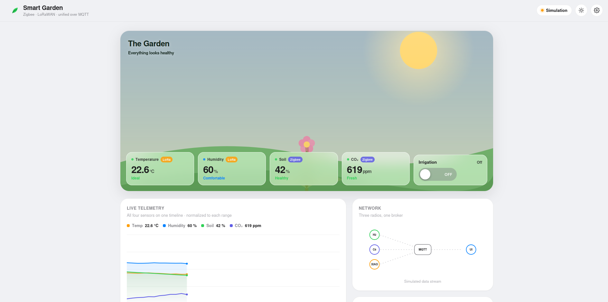
*The live dashboard. Each tile is tagged with its source protocol: Temperature/Humidity over **LoRa**, Soil/CO₂ over **Zigbee**.*

---

## 2. System Architecture

The system is organised into four layers. Every data source — regardless of radio — ends at **one broker**.

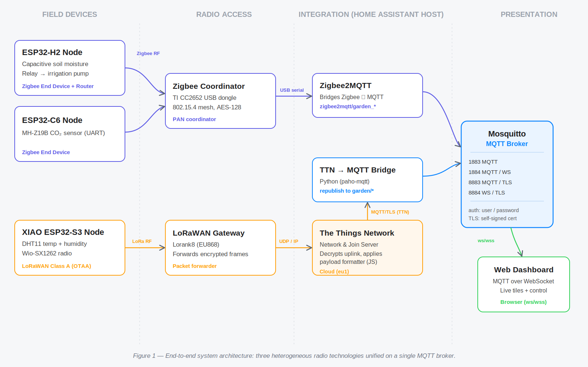

| Layer | Components | Role |
|-------|-----------|------|
| **Field devices** | ESP32-H2, ESP32-C6, XIAO ESP32-S3 | Sense the environment and actuate the pump |
| **Radio access** | Zigbee coordinator (CC2652), LoRaWAN gateway | Carry frames off-device |
| **Integration** | Zigbee2MQTT, TTN, Python bridge, Mosquitto | Normalise everything onto one MQTT namespace |
| **Presentation** | Web dashboard (MQTT-over-WebSocket) | Visualise and control |

---

## 3. Network Topology

Every endpoint and every connection in one view — the field devices on the left, the radios, the Home Assistant host with the broker at the centre, the cloud (TTN), and the browser client. Solid lines are data; the dashed line is the pump-control path.

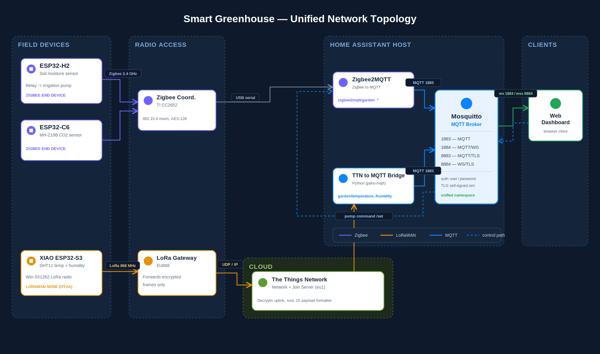

**Note on mesh:** the two Zigbee boards joined as **end devices**, so each talks **directly** to the coordinator (a single-hop **star**, not a multi-hop mesh). Configuring them as *routers* would enable meshing at the cost of higher power.

---

## 4. Hardware — Boards & Sensors

### Boards

| Board | Role | Radio | Notes |
|-------|------|-------|-------|
| **Espressif ESP32-H2** | Soil + irrigation node | 802.15.4 (Zigbee) + BLE, **no Wi-Fi** | Single-core RISC-V; low power |
| **Espressif ESP32-C6** | CO₂ node | Wi-Fi 6 + BLE 5 + 802.15.4 (**Zigbee used**) | Dual-core; only its 802.15.4 radio used here |
| **Seeed XIAO ESP32-S3** + **Wio-SX1262** | Climate node | **LoRa** (LoRaWAN) | SX1262 LoRa transceiver |
| **TI CC2652** USB dongle | Zigbee Coordinator **+ Trust Center** | 802.15.4 | Forms the PAN, assigns addresses, holds the network key |
| **LoRaWAN gateway** | Packet forwarder | LoRa (EU868) | Forwards encrypted frames only; cannot read payloads |

### Sensors & Actuator

| Component | Connected to | Interface | Measures / Does |
|-----------|--------------|-----------|------------------|
| **Capacitive soil moisture sensor** | ESP32-H2 | Analog (ADC) | Soil moisture (calibrated dry≈0, wet≈76 → 0–100 %) |
| **Relay module → water pump** | ESP32-H2 | GPIO (active-low) | Switches the irrigation pump |
| **MH-Z19B** | ESP32-C6 | UART | CO₂ concentration (NDIR) |
| **DHT11** | XIAO ESP32-S3 | Single-wire digital (GPIO2, internal pull-up) | Temperature + humidity |

---

## 5. The Wireless Technologies

| | **Zigbee** | **LoRaWAN** |
|---|-----------|-------------|
| Standard | IEEE 802.15.4 | LoRaWAN 1.1 |
| Frequency band | **2.4 GHz** ISM (16 channels, 11–26) | **868 MHz** (EU868) |
| Channel bandwidth | ~2 MHz | ~125 kHz |
| Modulation | **O-QPSK with DSSS** (chip sequences) | **CSS** — Chirp Spread Spectrum (swept-frequency chirps) |
| Media access | **CSMA/CA** (listen before talk) | **ALOHA** (transmit without listening — saves power) |
| Data rate | 250 kbit/s | ~0.3–50 kbit/s (SF7–SF12) |
| Range | Tens of metres (mesh-capable) | Up to a few km |
| Device class here | End device (star) | **Class A** (lowest power) |
| Air-link security | AES-128 network key | AES session keys (OTAA), end-to-end to TTN |

**Why two radios?** No single technology is optimal for both close-range powered devices and distant low-power sensors. The project embraces the split and unifies the result on MQTT.

---

## 6. Build Step by Step

### 6.1 Zigbee nodes (ESP32-H2 & ESP32-C6)

**Toolchain:** Arduino IDE with the ESP32 core **3.1.3**, partition scheme *“Zigbee 4MB with spiffs”*, Zigbee mode *End Device*.

**ESP32-H2 — soil + pump**
- Reads the capacitive soil probe on an ADC channel; maps raw value to 0–100 %.
- Drives the pump relay. The relay is **active-low**, so the GPIO is set HIGH *before* `pinMode()` to stop the pump energising during reset.
- Exposes an analog-input cluster (soil) and an on/off cluster (pump) over Zigbee.

**ESP32-C6 — CO₂**
- Reads the **MH-Z19B** over UART.
- CO₂ auto-reporting is configured in Zigbee2MQTT (see below) rather than left to firmware defaults.

**Pairing & discovery with Zigbee2MQTT**

1. In Zigbee2MQTT, enable **Permit Join**, then power the board so it associates with the CC2652 coordinator.
2. Rename each device to a clear name — `garden_h2` and `garden_co2` — which sets the MQTT topic (`zigbee2mqtt/<name>`).
3. Verify the live data and the exact field names directly on the broker:

   ```bash
   mosquitto_sub -h core-mosquitto -u <user> -P <pass> -t 'zigbee2mqtt/garden_h2' -v
   mosquitto_sub -h core-mosquitto -u <user> -P <pass> -t 'zigbee2mqtt/garden_co2' -v
   ```

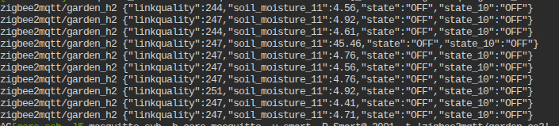
*ESP32-H2 publishes `soil_moisture_11`, plus the pump `state`, on one shared device topic.*

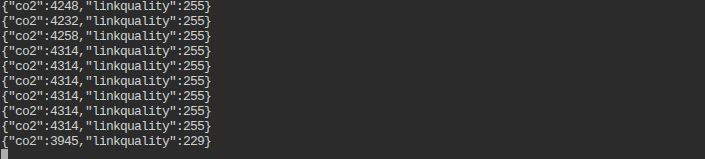
*ESP32-C6 publishes `co2`.*

**Fixing CO₂ auto-reporting** — the default *Max report interval* was 3600 s (once an hour), so the value only refreshed on manual poll. Setting it to **60 s** in the device’s **Reporting** tab makes it update on its own.

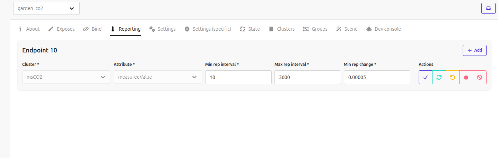
*`msCO2 / measuredValue` reporting set to min 10 s, max 60 s.*

**Controlling the pump** — publish to the device’s `/set` topic:

```bash
mosquitto_pub -h core-mosquitto -u <user> -P <pass> \
  -t 'zigbee2mqtt/garden_h2/set' -m '{"state":"ON"}'
```

> **Soil & pump share one topic.** Because the soil sensor and the relay are the *same physical device*, both `soil_moisture_11` and `state` arrive in the same `garden_h2` JSON. The dashboard reads both from that single topic.

---

### 6.2 LoRaWAN node (XIAO ESP32-S3)

**Sensor wiring:** DHT11 data on **GPIO2** with the internal pull-up. Use the **Adafruit “DHT sensor library”** (not a vendor-bundled `DHT.h`, which targets the I²C DHT20 and causes linker errors).

**Firmware behaviour:**
- Reads temperature and humidity.
- Packs them as two big-endian 16-bit values (each ×100) into a **4-byte uplink**.
- Joins TTN using **OTAA** and transmits as a **Class A** device.

**Joining The Things Network (OTAA):**

1. Register the device in TTN with its **DevEUI**, **JoinEUI** (all-zeros is an accepted placeholder), and the root **AppKey** + **NwkKey** (LoRaWAN 1.1 requires both).
2. Flash and power the node; confirm the join and uplinks in **TTN → Live data**.

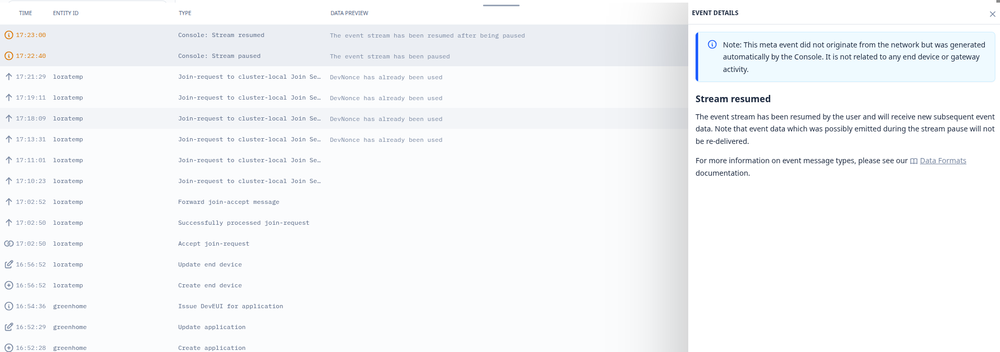
*Successful OTAA join and uplink reception in the TTN console.*

3. Add an **uplink payload formatter** (JavaScript) so TTN decodes the 4 raw bytes into named fields:

   ```javascript
   function decodeUplink(input) {
     var b = input.bytes;
     var temperature = ((b[0] << 8) | b[1]) / 100.0;
     var humidity    = ((b[2] << 8) | b[3]) / 100.0;
     return { data: { temperature: temperature, humidity: humidity } };
   }
   ```

> **Anti-replay note:** TTN rejects a reused **DevNonce** in the Join-Request (a replay protection). If the device reuses one after a reboot, reset the DevNonce/frame counters in TTN, or have the device persist and increment it.

---

### 6.3 The TTN → MQTT bridge

The LoRaWAN data lands in the **cloud** (TTN), separate from the local Zigbee data. A small **Python service** (`paho-mqtt`) closes the gap: it subscribes to TTN’s MQTT server, extracts the decoded temperature/humidity, and **republishes** them to the **local** broker.

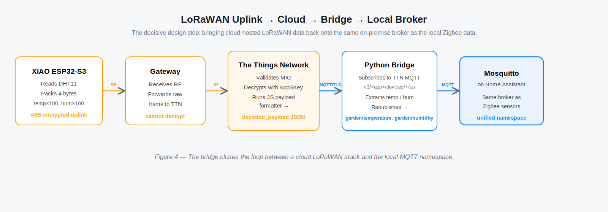

```
XIAO → Gateway → TTN (decrypt + decode) → Python bridge → local Mosquitto
```

- TTN credentials: **App ID**, region (`eu1`), and an **MQTT API key** (TTN → Integrations → MQTT).
- Publishes to `garden/temperature` and `garden/humidity` on the local broker (port **1883**).
- Uses **`retain=True`**, so the broker stores each *last known value* — a newly-connected dashboard immediately sees the latest reading even between infrequent LoRaWAN uplinks.

> **Why this matters:** without the bridge, LoRaWAN data would stay siloed in the cloud and the dashboard would need two backends. The bridge collapses both ecosystems into **one MQTT namespace**.

Verify the bridge output independently:

```bash
mosquitto_sub -h core-mosquitto -u <user> -P <pass> -t 'garden/#' -v
```

---

### 6.4 The MQTT broker (Mosquitto on Home Assistant)

The Home Assistant **Mosquitto add-on** exposes four listeners:

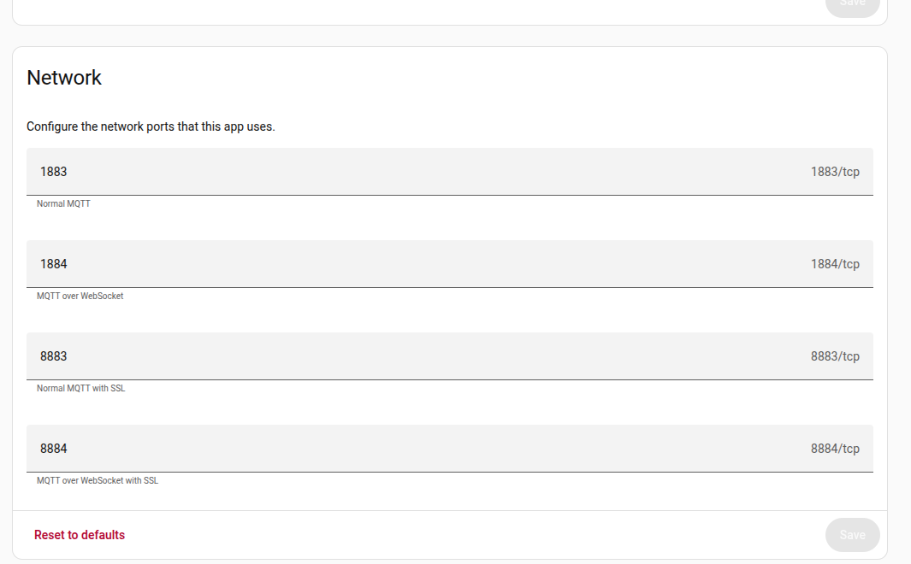

| Port | Purpose |
|------|---------|
| **1883** | MQTT (plain) — devices / Zigbee2MQTT / bridge |
| **1884** | MQTT over WebSocket (plain) — browser |
| **8883** | MQTT over **TLS** |
| **8884** | MQTT over WebSocket over **TLS** (`wss://`) — secure browser |

- **Authentication:** username/password users (e.g. `mohammed`, `viewer`); anonymous access disabled.
- **TLS:** a certificate (`fullchain.pem` / `privkey.pem`) placed in the HA `/ssl/` folder enables 8883/8884.

---

### 6.5 The web dashboard

A single-page web app that connects to Mosquitto over **MQTT-over-WebSocket** — the browser is a first-class MQTT client, so no extra server is needed.


*Day theme. A reactive scene with frosted-glass tiles over a unified telemetry chart and a live network view.*

**Features**
- **Reactive scene** — sky, soil bed and plant respond to live readings; day/night theme toggle.
- **Unified chart** — all four sensors on one normalised timeline.
- **Network view** — links pulse as data arrives from each radio.
- **Direct control** — the pump toggle publishes to `zigbee2mqtt/garden_h2/set`.
- **Protocol tags** — each tile shows whether it came from Zigbee or LoRa.

**Connecting (Live mode):** gear → **Live (MQTT)** →

| Field | Value |
|-------|-------|
| Broker URL (plain) | `ws://<HA-IP>:1884` |
| Broker URL (TLS) | `wss://<HA-IP>:8884` |
| Username / Password | your MQTT user |
| Soil topic | `zigbee2mqtt/garden_h2` |
| CO₂ topic | `zigbee2mqtt/garden_co2` |
| Temperature / Humidity | `garden/temperature` · `garden/humidity` |
| Pump state / command | `zigbee2mqtt/garden_h2` · `zigbee2mqtt/garden_h2/set` |

> **Secure WebSocket caveat:** with a self-signed certificate, a browser won’t trust `wss://<HA-IP>:8884` until you visit `https://<HA-IP>:8884` once and accept the warning. There is no browser equivalent of `--insecure`.

---

## 7. Security Assessment

Conducted entirely on the author’s own broker and devices — a **self-contained testbed** — following a *vulnerable → exploited → mitigated* structure.

### 7.1 Per-protocol posture

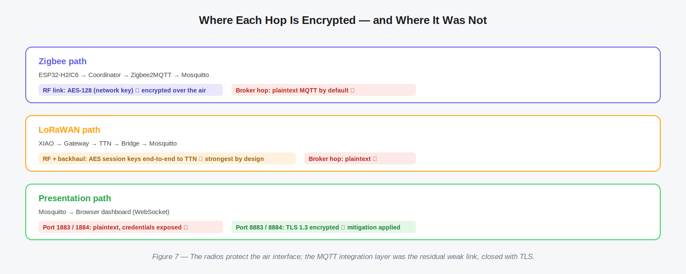

- **Zigbee** encrypts the RF link with an AES-128 network key — but that protection ends at the coordinator.
- **LoRaWAN** is strongest by design: AES session keys protect the payload end-to-end to TTN, and the gateway only forwards ciphertext.
- **MQTT**, by default, is the weak link: data and credentials cross the broker hop in plaintext.

### 7.2 Demonstration 1 — unauthorised control

With valid (but over-privileged) credentials, any client can publish to the pump command topic and physically actuate it:

```bash
mosquitto_pub -h 192.168.10.130 -u viewer -P 'viewer_1234' \
  -t 'zigbee2mqtt/garden_h2/set' -m '{"state":"ON"}'
```

**Lesson:** authentication alone is insufficient when accounts are over-privileged — least-privilege ACLs are needed.

### 7.3 Demonstration 2 — plaintext on the wire

A capture on port **1883** is fully human-readable. The MQTT **CONNECT** packet exposes the username and password in clear text:

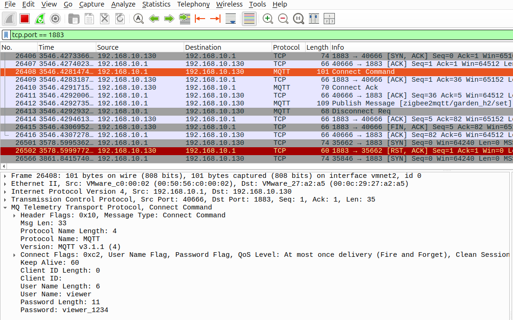

…and a **PUBLISH** to the pump topic shows the command in the clear:

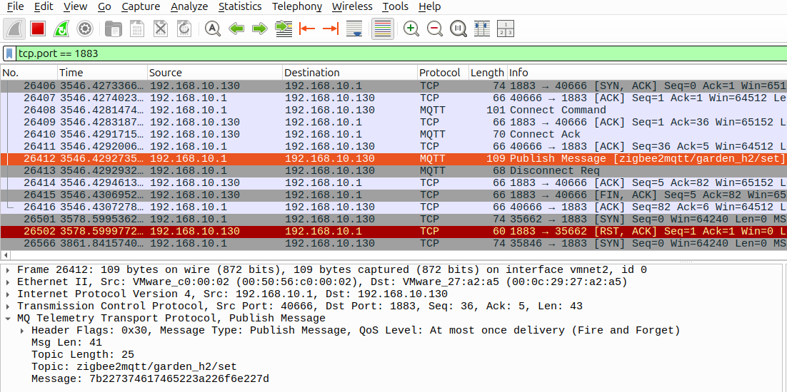

### 7.4 Mitigation — TLS

Connecting over the TLS port encrypts the entire session. The same traffic on **8883** is now **TLS 1.3** “Encrypted Application Data” — Wireshark still recognises the inner protocol as MQTT, but the payload is unreadable:

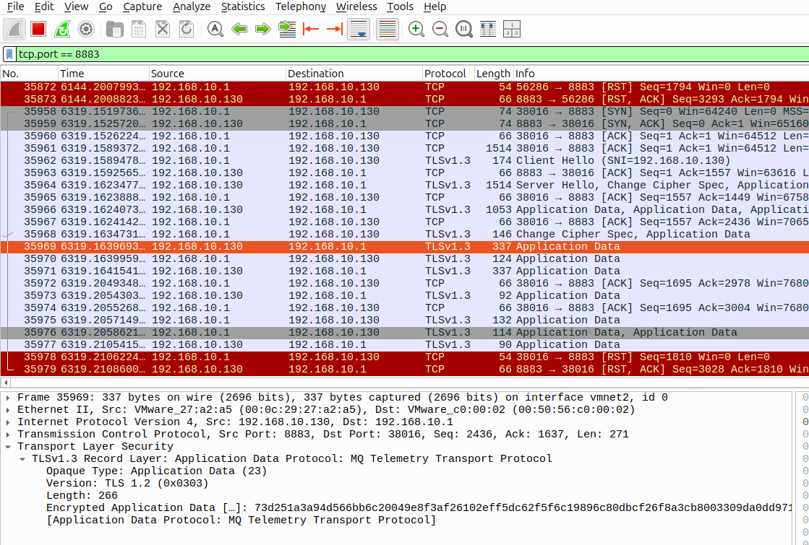

Verify a TLS client connection:

```bash
mosquitto_sub -h 192.168.10.130 -p 8883 --cafile fullchain.pem --insecure \
  -u mohammed -P '<pass>' -t 'zigbee2mqtt/garden_h2' -v
```

**Takeaway:** the radios already protect the air interface; the MQTT broker hop was the residual weak link, and TLS closes it — including the browser dashboard once it uses `wss://` on 8884.

---

## 8. Power & Frequency Reference

Frequencies and power are summarised below. *Power figures are typical datasheet values, not bench-measured.*

| Node | Component | Voltage (USB) | Typical current | Power |
|------|-----------|---------------|-----------------|-------|
| **Node 1 — H2** | ESP32-H2 board | 5 V | ~10 mA | ~0.05 W |
| | Soil sensor | 3.3 V | ~5 mA | ~0.017 W |
| | Relay (ON) | 5 V | ~70 mA | ~0.35 W |
| **Node 2 — C6** | ESP32-C6 board | 5 V | ~25 mA | ~0.125 W |
| | MH-Z19B (avg / peak) | 5 V | ~20 / 150 mA | ~0.10 / 0.75 W |
| **Node 3 — XIAO** | XIAO ESP32-S3 board | 5 V | ~40 mA | ~0.20 W |
| | SX1262 (TX peak) | 5 V | ~118 mA | ~0.59 W |
| | DHT11 | 3.3 V | ~2.5 mA | ~0.008 W |
| **Overall** | All three nodes | — | — | **≈ 0.85 W typical** |

> Power = V × I. Boards are calculated at 5 V (USB input); sensors at the rail they run on. To get exact figures, measure each node’s USB input with an inline power meter.

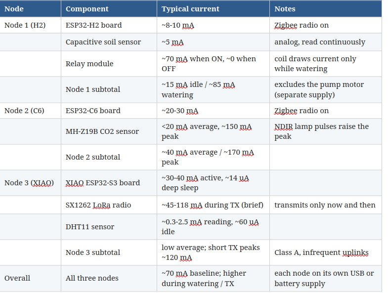

---

## 9. Repository Layout

```
.
├── README.md
├── assets/                         # all images referenced above
├── firmware/
│   ├── esp32_h2_soil_pump/         # Zigbee soil + relay
│   ├── esp32_c6_co2/               # Zigbee CO2
│   └── lorawan_dht11_node.ino      # XIAO ESP32-S3 LoRaWAN
├── bridge/
│   └── ttn_bridge.py               # TTN → Mosquitto bridge
└── dashboard/
    └── smart-garden-dashboard.html # web dashboard (MQTT over WebSocket)
```

*(Place each firmware sketch in a clean folder with no stray `DHT.h`. Fill in TTN credentials in `ttn_bridge.py` before running.)*

---

## 10. Notes & Future Work

- **Per-role ACLs** so a monitoring account cannot command the pump (least privilege).
- **CA-signed certificates** and **mutual TLS** (client certificates) instead of self-signed.
- **Time-series storage** (e.g. InfluxDB) for long-term trends.
- **Closed-loop irrigation** — water automatically when soil moisture drops below a threshold.

---

### Acknowledgements & Stack

ESP32-H2 · ESP32-C6 · Seeed XIAO ESP32-S3 + Wio-SX1262 · TI CC2652 · The Things Network · Zigbee2MQTT · Eclipse Mosquitto · Home Assistant · paho-mqtt · MQTT.js

> *Self-contained research testbed. All security testing was performed only on the author’s own broker and devices.*
